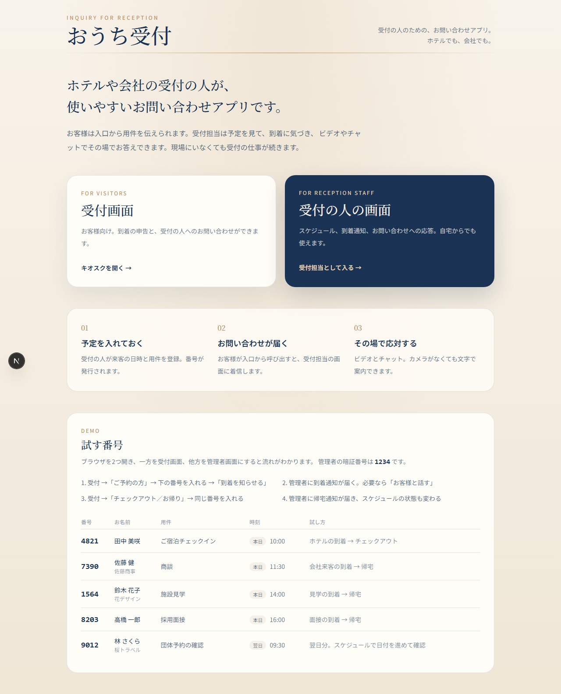
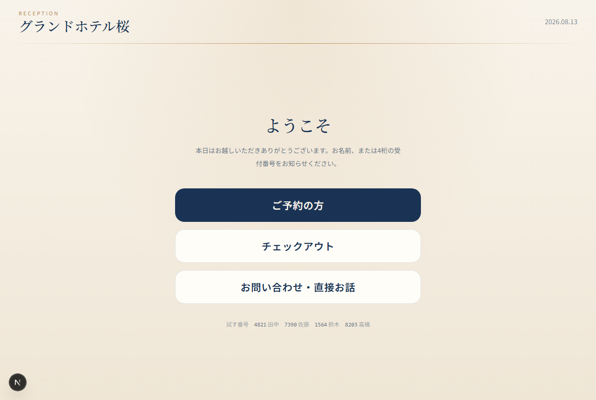
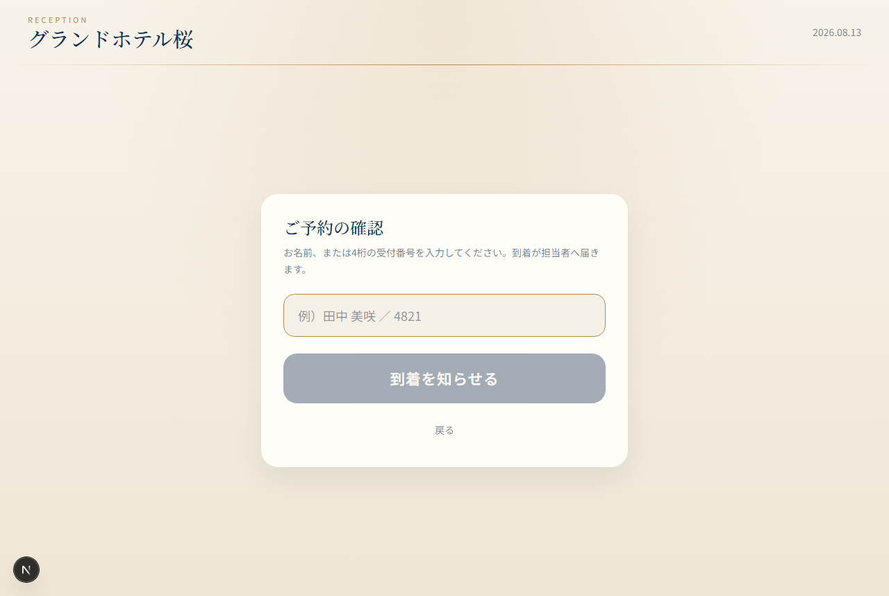
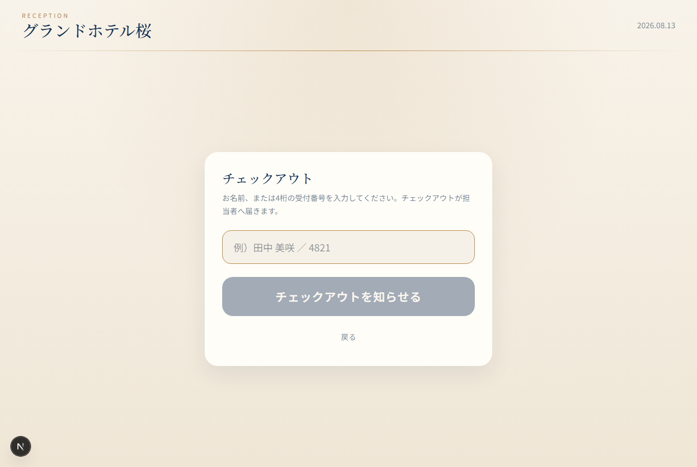
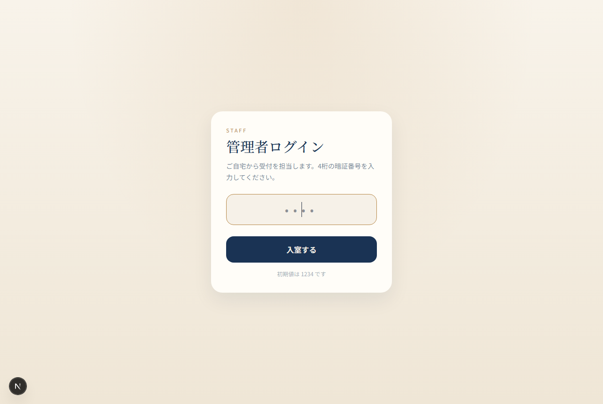
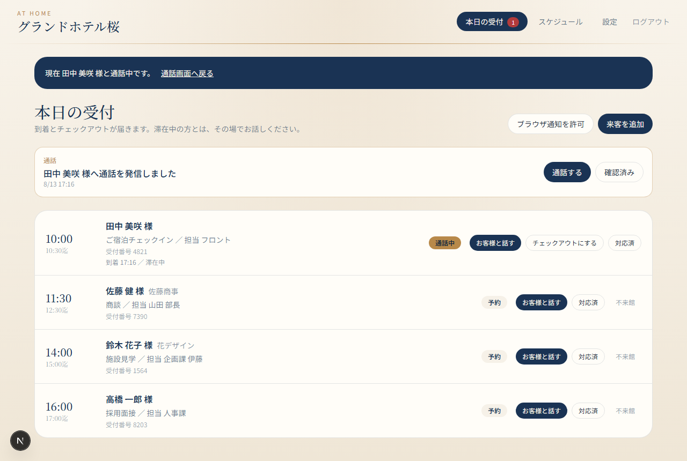
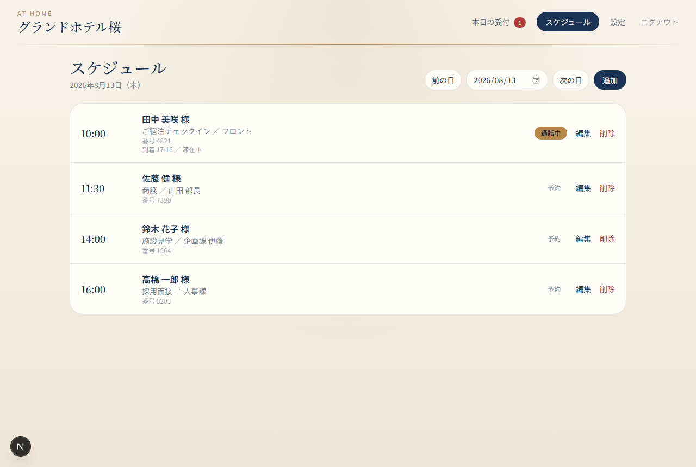
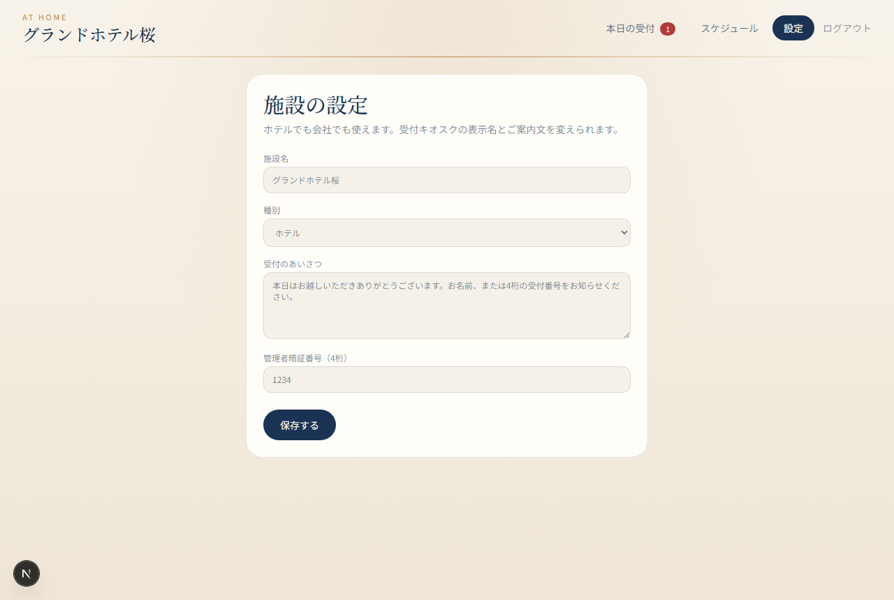

# おうち受付 — 学校提出資料

先生へ提出する資料の入口です。ソースは `frontend/`（画面）と `backend/`（API）に分かれています。

**リポジトリ:** https://github.com/n0r1k09583/OuchiUketsuke  
**本ページ:** https://github.com/n0r1k09583/OuchiUketsuke/blob/main/docs/README.md

ソースと提出資料は GitHub で誰でも閲覧できます。アプリ本体のインターネット公開（常時稼働の受付画面）はありません。動作確認はローカル（http://localhost:3000、管理者 PIN `1234`）です。

---

## 1. 要件定義書

| 資料 | 内容 | URL |
|------|------|-----|
| 提出用HTML | 表紙つきの要件定義書（印刷／PDF向け） | [docs/要件定義書.html](./要件定義書.html) |
| Markdown | 同じ内容の読みやすい版 | [docs/requirements.md](./requirements.md) |
| 技術選定書 | 前回（Vite / Spring / PostgreSQL）と違う理由 | [docs/tech-selection.md](./tech-selection.md) |
| AWS・提出の見方 | 無料枠・常時稼働なしの説明 | [docs/aws-for-teacher.md](./aws-for-teacher.md) |

HTML を PDF にするときは、ファイルをブラウザで開き **Ctrl+P → PDF に保存** です。

---

## 2. フロントエンドの画面画像

実装した画面のスクリーンショットです。フォルダ: [docs/images](./images)

### トップ（受付／管理者の入口）



### 受付キオスク（来客）







### 管理者（受付の人）









| ファイル | 画面 |
|----------|------|
| `01-top.png` | トップ |
| `02-reception.png` | 受付キオスク |
| `03-reception-checkin.png` | 到着申告 |
| `04-reception-checkout.png` | チェックアウト／帰宅 |
| `05-admin-login.png` | 管理者ログイン |
| `06-admin-today.png` | 本日の受付 |
| `07-admin-schedule.png` | スケジュール |
| `08-admin-settings.png` | 設定 |

フロントの実装場所: `frontend/`（Next.js :3000）。バックエンドは `backend/`（Express :8080）。別プロジェクトです。

---

## 3. バックエンドの詳細

| 資料 | 内容 | URL |
|------|------|-----|
| **バックエンド詳細** | 構成、保存、API一覧、リクエスト例 | [docs/backend.md](./backend.md) |
| 基本設計書 | 画面・データ・API・通話方針 | [docs/basic-design.md](./basic-design.md) |
| 実装 | Express 本体 | [backend/src/server.ts](../backend/src/server.ts) |

バックエンドは Express :8080。画面は Next.js が `/api/*` を転送します。保存は `backend/data/ouchi-uketsuke.db`（SQLite。Git には含めません）。

---

## 4. 起動（評価用）

```sh
npm install --prefix frontend
npm install --prefix backend
npm run dev --prefix frontend
npm run dev --prefix backend
```

- フロント http://localhost:3000
- バック http://localhost:8080/api/health
- 管理者 PIN `1234`
