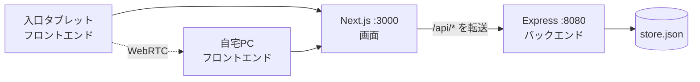
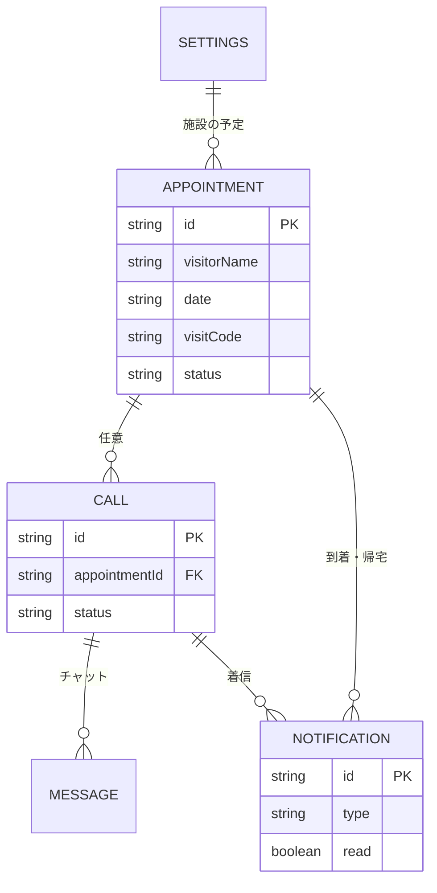

# おうち受付 基本設計書

## 0. 本書について

本書は [docs/requirements.md](./requirements.md) で決めた「何を作るか」を受けて、「どう作るか」をまとめる。  
前回課題（Vite / Java Spring Boot Gradle / PostgreSQL）とは異なるスタックの理由は [docs/tech-selection.md](./tech-selection.md) を正とする。

## 1. 技術スタックと選定理由

| レイヤー | 採用技術 | 前回（使わない） | 選定理由 |
|----------|----------|------------------|----------|
| フロント | Next.js App Router + TypeScript | Vite + React | 受付画面と API 転送を Next で扱う。Vite SPA にしない |
| バック | Node.js + Express | Java + Spring Boot + Gradle | JVM に依存せず API を自前で置く |
| 保存 | JSON ファイル | PostgreSQL | RDB を使わず問い合わせと予定を残す |
| 通話 | WebRTC | — | お問い合わせをその場で話す |
| インフラ | ローカル評価、AWS 常時稼働なし | — | 月額課金を出さない |

フロントエンドとバックエンドは別プロセスである。

- フロントエンド: ポート 3000（画面）
- バックエンド: ポート 8080（`/api/*`）
- Next.js の rewrites で、ブラウザは今までどおり `/api/...` にアクセスする

## 2. システム構成図



- 受付画面と管理者画面は、バックエンドの最新状態を短い間隔で取得する（ポーリング）
- ビデオは端末同士（WebRTC）。オファー／アンサー／ICE候補だけバックエンドが一時保持する
- カメラが使えない場合でも、チャットはバックエンド経由で届く

## 3. 画面設計

| 画面 | パス | 内容 |
|------|------|------|
| トップ | `/` | 受付／管理者への入口 |
| 受付 | `/reception` | 予約確認、到着、問い合わせ、待機 |
| 管理者 | `/admin` | ログイン後、本日の予定・通知・着信 |
| スケジュール | `/admin/schedule` | 日付別の予定CRUD |
| 設定 | `/admin/settings` | 施設名・PIN |
| 通話 | `/call/[id]?role=admin\|visitor` | 映像・チャット・終了 |

管理者の入室状態はブラウザの `sessionStorage` に保持する。暗証番号の照合は `POST /api/auth` で行う。

## 4. データ設計

### 来客予定（Appointment）

| 項目 | 型 | 説明 |
|------|-----|------|
| id | string | 主キー |
| visitorName | string | お客様名 |
| visitorOrg | string | 会社・団体 |
| hostName | string | 担当者 |
| purpose | string | 用件 |
| date | string | YYYY-MM-DD |
| startTime / endTime | string | HH:mm |
| visitCode | string | 4桁の受付番号 |
| status | string | scheduled / arrived / in-call / departed / completed / cancelled / no-show |
| arrivedAt | string \| null | 到着時刻 |
| departedAt | string \| null | チェックアウト／帰宅時刻 |
| notes | string | メモ |

### 通話（Call）

| 項目 | 型 | 説明 |
|------|-----|------|
| id | string | 主キー |
| appointmentId | string \| null | 紐づく予定 |
| visitorName | string | 来客名 |
| reason | string | arrival / inquiry |
| status | string | ringing / active / ended |
| messages | array | チャット |
| signal | object | WebRTC の offer / answer / ICE |

### 通知（Notification）

到着・チェックアウト（会社は帰宅）または着信のメッセージ、既読フラグを持つ。

### ER図（概念）



## 5. API設計

バックエンド（Express :8080）が REST API を提供する。フロントエンドは `/api` 配下へ JSON で呼び出す（Next.js がバックエンドへ転送する）。

| メソッド | パス | 内容 |
|----------|------|------|
| GET | `/api/snapshot` | 予定・通話・通知・設定の一括取得 |
| POST | `/api/auth` | 管理者PIN照合 |
| PATCH | `/api/settings` | 施設設定の更新 |
| POST | `/api/appointments` | 予定の登録 |
| PATCH | `/api/appointments/[id]` | 予定の更新 |
| DELETE | `/api/appointments/[id]` | 予定の削除 |
| POST | `/api/checkin` | 氏名または番号で到着申告 |
| POST | `/api/checkout` | 氏名・番号または予定IDでチェックアウト／帰宅 |
| POST | `/api/calls` | 通話の作成（既存の着信があれば再利用） |
| GET / PATCH | `/api/calls/[id]` | 通話の取得・状態更新 |
| POST | `/api/calls/[id]/messages` | チャット送信 |
| GET / POST | `/api/calls/[id]/signal` | WebRTC シグナリング |
| PATCH | `/api/notifications/[id]` | 既読にする |

**POST /api/checkin（リクエスト）**
```json
{ "query": "4821" }
```

**POST /api/checkout（リクエスト）**
```json
{ "query": "4821" }
```
または `{ "appointmentId": "apt_xxx" }`。状態を `departed` にし、帰宅通知を作る。

バックエンドの項目ごとの説明は [docs/backend.md](./backend.md) を正とする。

## 6. 通話の接続方針

1. 来客側がカメラ／マイクを取得し、オファーをサーバーへ送る
2. 管理者側がオファーを受け取り、アンサーを返す
3. ICE候補を互いに送り、映像をつなぐ
4. 失敗時もチャットは利用可能

STUN は公開サーバー（Google STUN）を使う。TURN は課題範囲外とする。

## 7. セキュリティ方針（課題範囲）

- 管理者画面はPIN照合後のみ操作する
- `.env` は Git に含めない
- `backend/data/store.json` は実行時データのため Git に含めない
- AWS の実リソースは作らない。誤って作った場合は直ちに削除する

本番運用する場合は、サーバー側セッション、PINのハッシュ化、通話ロールの検証を追加する。

## 8. 例外処理方針

- API は失敗時に HTTP ステータスと `{ "error": "メッセージ" }` を返す
- 受付の予約なし、PIN不一致は画面上に日本語で表示する
- カメラ拒否は通話画面で案内し、チャットへ誘導する
