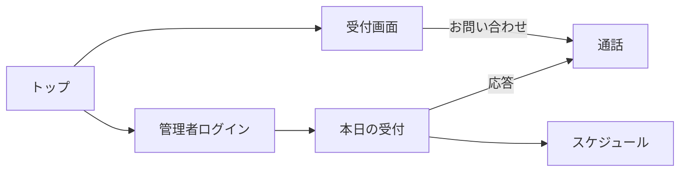

# おうち受付 要件定義書（お問い合わせアプリ）

技術的な詳細は [docs/basic-design.md](./basic-design.md)、前回と違う技術の証明は [docs/tech-selection.md](./tech-selection.md) を参照する。

## 1. 概要・背景・目的

### 概要

本課題の作品は **お問い合わせアプリ** である。ホテルや会社の **受付の人** が使いやすいことを第一に考える。入口に来たお客様が用件を伝え、受付担当は現場にいなくても予定を見て、到着に気づき、ビデオまたはチャットで直接応対できる。

### 背景

受付は入口に人がいないと、お客様が「誰に話せばよいか」分からなくなる。在宅やバックヤードにいる担当者にも、問い合わせと到着が届く必要がある。

本アプリはスクール課題である。前回課題（React + TypeScript + Vite + Tailwind、Java + Spring Boot + Gradle + PostgreSQL）とは **異なる技術スタック** を使うことが求められている。AI を補助にしつつ、技術の選定と構築は自分で行い、特定技術に依存しない応用力を示す。

### 目的

- 受付の人が、来客の問い合わせとスケジュールを扱いやすい
- お客様が入口からお問い合わせ・到着申告・チェックアウト（会社は帰宅）できる
- 自宅にいても、来たことと帰ったことが分かり、直接話せる
- ホテルでも会社でも、施設名を変えて使える
- 前回と違う土台（Next.js / Express / SQLite / WebRTC）で動かす

## 2. 対象ユーザー

| アクター | 説明 |
|----------|------|
| 受付担当（管理者） | ホテル・会社の受付の人。予定、通知、問い合わせ応対の主役 |
| 来客 | 入口の画面から到着やお問い合わせをする |

## 3. 機能要件（MVP）

| # | 機能 | 内容 |
|---|------|------|
| 1 | お問い合わせ | 予約がなくても氏名を入れ、受付担当を呼び出して直接話せる |
| 2 | 来客予定の管理 | 受付の人が氏名・日時・用件を登録・編集・削除する。受付番号を発行する |
| 3 | 本日一覧 | 当日の予定と状態を時刻順に見る |
| 4 | 到着申告 | 氏名または受付番号で当日予定と照合し、到着にする |
| 5 | チェックアウト／帰宅 | 滞在中の来客が氏名または番号で退出を申告する。ホテルはチェックアウト、会社は帰宅 |
| 6 | 到着・帰宅・着信の通知 | 受付担当の画面に表示し、音で知らせる。スケジュールの状態にも反映する |
| 7 | 直接会話 | ビデオとチャット。カメラなしでもチャットで案内できる |
| 8 | 施設設定 | 施設名、ホテル／会社、あいさつ、暗証番号 |

## 4. 非機能要件

- 受付画面は大きなボタンで、立ったまま操作しやすい
- 管理者画面は暗証番号で入室する
- 到着・帰宅・着信は数秒以内に反映する
- 映像が切れてもチャットで問い合わせを続けられる
- 一般公開しない。AWS の月額課金を出さない

## 5. 画面一覧

| 画面 | 役割 | 主な利用者 |
|------|------|------------|
| トップ | 受付／管理者の入口 | 全員 |
| 受付キオスク | 到着、チェックアウト／帰宅、お問い合わせ | 来客 |
| 管理者ログイン | 4桁暗証番号 | 受付担当 |
| 本日の受付 | 通知、着信、今日の予定と滞在 | 受付担当 |
| スケジュール | 予定の追加・編集・削除 | 受付担当 |
| 設定 | 施設情報 | 受付担当 |
| 通話 | ビデオとチャット | 両方 |

### 画面遷移

## 6. スコープ外

- 宿泊予約、決済、ゲート開錠
- 前回と同じ Vite / Spring Boot / PostgreSQL 構成
- インターネットへの本番公開

## 7. 受け入れ基準

- [x] 受付担当が予定を登録できる
- [x] お客様がお問い合わせでき、担当が応答できる
- [x] 到着と帰宅（チェックアウト）が担当に分かる
- [x] カメラなしでもチャットが届く
- [x] フロント（`frontend/` Next.js）とバック（`backend/` Express）がフォルダごと分かれている
- [x] 前回スタック（Vite / Java Spring Gradle / PostgreSQL）を使っていない
