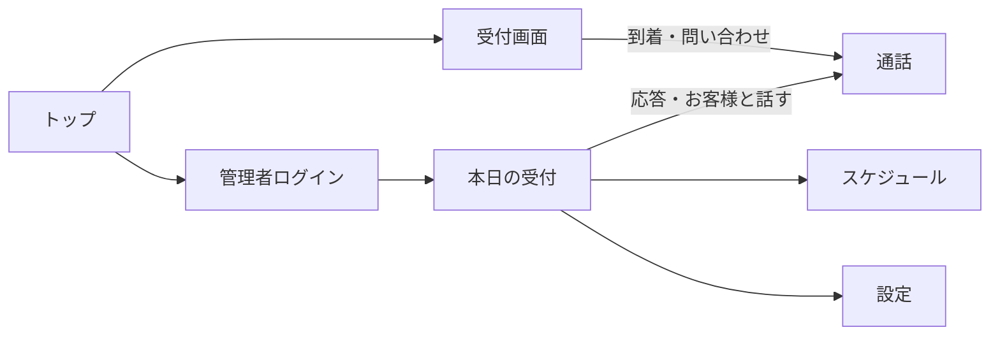

# おうち受付 要件定義書

技術的な詳細（ER図、API、技術スタックの選定理由など）は [docs/basic-design.md](./basic-design.md)（基本設計書）にまとめている。本書は「何を作るか・なぜ作るか」を中心に記載する。

学校提出用の体裁（表紙・図表つき）は [docs/要件定義書.pdf](./要件定義書.pdf) も参照。

## 1. 概要・背景・目的

### 概要

ホテルのフロントや企業の受付に置く来客用画面と、担当者が自宅で見る管理者画面を、1つのWebシステムでつなぐアプリケーション。来客の予定を登録し、お客様が入口に着いたことを管理者へ知らせ、問い合わせがあればビデオ通話とチャットで直接話せる。

### 背景

受付業務は入口に人がいないと成り立たないことが多い。担当者が在宅勤務やバックヤードにいると、来客の到着に気づけず、予定確認も紙や口頭に散らばりやすい。予約外の問い合わせにも、その場で担当者と話せないとお待たせになる。

本アプリはスクールの課題として開発する。提出リポジトリの見せ方は、学校の例（[RecipeManager](https://github.com/marinnk/RecipeManager)）に合わせている。

### 目的

- 自宅にいながら、来客の受付スケジュールを管理できる
- 予定に入っているお客様が来たら、管理者にすぐ分かる
- お客様が問い合わせたいとき、受付担当と直接話せる
- ホテルでも会社でも、施設名を変えて使える

## 2. 対象ユーザー

| アクター | 説明 |
|----------|------|
| 来客 | ホテルの宿泊者・面会者、企業への来訪者。入口の受付画面を操作する |
| 管理者 | 自宅など遠隔地から受付を担当する職員 |

複数施設・複数管理者の本格的な権限管理は想定しない（課題範囲のMVP）。

## 3. 機能要件（MVP）

| # | 機能 | 内容 |
|---|------|------|
| 1 | 来客予定の管理 | 氏名・日時・用件・担当者などを登録・編集・削除する。受付番号（4桁）を発行する |
| 2 | 本日一覧 | 当日の予定を時刻順に表示し、状態（予約／到着／通話中／対応済／取消／不来館）を更新できる |
| 3 | 到着申告 | 受付画面で氏名または受付番号を入力すると、当日予定と照合して到着にする |
| 4 | 到着通知 | 管理者画面に通知と音で知らせる。ブラウザ通知は任意 |
| 5 | 問い合わせ | 予約がなくても氏名を入れて受付担当を呼び出せる |
| 6 | 直接会話 | ビデオ通話とチャット。カメラが使えない場合はチャットだけで案内できる |
| 7 | 施設設定 | 施設名、ホテル／会社の種別、あいさつ文、管理者暗証番号を変更できる |

## 4. 非機能要件

- **認証**: 管理者画面は4桁の暗証番号で入室する。来客画面に認証は設けない
- **即時性**: 到着・着信は、管理者画面が開いていれば数秒以内に反映する
- **可用性**: 映像がつながらなくてもチャットで業務を続けられる
- **対応デバイス**: Windows 上の最新 Chrome / Edge。受付はタブレットでも操作しやすい大きなボタンとする
- **デモ**: 初回起動時に当日のサンプル予定があり、すぐに流れを試せる

## 5. 画面一覧・イメージ

| 画面 | 役割 |
|------|------|
| トップ | 受付画面と管理者画面への入口 |
| 受付キオスク | 予約確認、到着申告、問い合わせ、待機 |
| 管理者ログイン | 4桁暗証番号 |
| 本日の受付 | 当日予定、通知、着信、応対 |
| スケジュール | 日付別の予定追加・編集・削除 |
| 設定 | 施設情報と暗証番号 |
| 通話 | 映像、チャット、終了 |

### 画面イメージ（ラフ）

**受付画面**
```
┌────────────────────────────────────────┐
│  グランドホテル桜                       │
│  ようこそ                               │
│                                          │
│  [ ご予約の方           ]               │
│  [ お問い合わせ・直接お話 ]               │
└────────────────────────────────────────┘
```

**管理者：本日の受付**
```
┌────────────────────────────────────────┐
│  おうち受付     本日の受付 / 予定 / 設定 │
├────────────────────────────────────────┤
│  ● 田中 美咲 様が受付に到着されました    │
│                                          │
│  10:00  田中 美咲  チェックイン  [到着]  │
│  11:30  佐藤 健    商談          [予約]  │
└────────────────────────────────────────┘
```

### 画面遷移



## 6. データ要件

本アプリが扱う主なデータは次のとおり。

- **来客予定**: 氏名、日時、用件、担当者、受付番号、状態
- **通話**: 来客名、理由（到着／問い合わせ）、チャット、接続情報
- **通知**: 到着または着信のお知らせ
- **施設設定**: 施設名、種別、あいさつ、管理者PIN

詳細な項目と関連は [基本設計書](./basic-design.md) を参照。

## 7. スコープ外（今回作らないもの）

- 宿泊予約・部屋割り・決済
- 社員証認証、入退館ゲートの開錠
- メール／SMS での受付番号通知
- 通話の録画保存
- 本格的な会員登録（メール認証、複数ロール）

## 8. 受け入れ基準（完成の定義）

以下をすべて満たした状態を「MVP完成」とする。

- [x] 管理者が来客予定を登録でき、受付番号が表示される
- [x] 受付で氏名または番号を入れると、管理者に到着が分かる
- [x] 来客または管理者から通話を開始し、ビデオまたはチャットで話せる
- [x] 予約なしの問い合わせでも着信し、会話できる
- [x] カメラを拒否してもチャットが届く
- [x] 誤った暗証番号では管理者画面に入れない
- [x] 施設名をホテル／会社向けに変更できる

## 9. リスクと対応策

| リスク | 影響 | 対応策 |
|--------|------|--------|
| 映像がネットワークの都合でつながらない | 顔を見ながら案内できない | チャットを標準機能として用意する |
| 暗証番号が短い | 第三者が管理者画面を開く可能性 | 課題用の検証環境として許容する。本番ではより強い認証を検討する |
| 保存が1台の開発サーバー依存 | サーバー停止で予定が見られない | 課題提出の範囲ではローカル起動を前提とする |

## 10. 前提

- 検証は `npm run dev` で開発サーバーを起動した状態で行う
- 入口端末と自宅端末は、同じアプリのURLにアクセスできること
- 提出用のGitHubリポジトリ構成は、学校例の RecipeManager に合わせる
